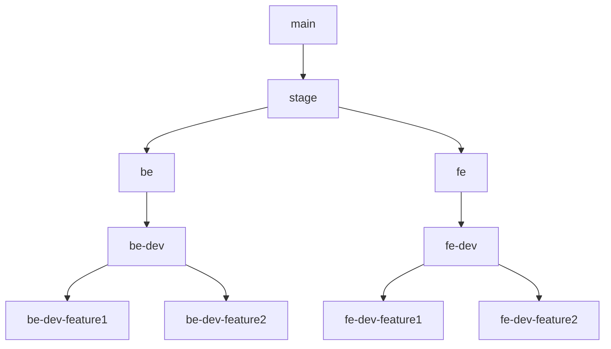

# Travsy - Aplikasi Pencarian Travel Guide Provinsi Bali

Travsy adalah platform pencarian dan perencanaan perjalanan yang dirancang untuk membantu wisatawan merencanakan perjalanan mereka ke Provinsi Bali dengan lebih mudah. Platform ini menyediakan informasi terpadu tentang berbagai destinasi wisata, pemandu lokal, dan paket wisata di seluruh pulau Bali.

## Ringkasan Proyek

Provinsi Bali dikenal sebagai salah satu destinasi wisata paling populer di dunia. Meskipun keindahan alam dan kekayaan budaya Bali menarik banyak wisatawan, seringkali sulit bagi mereka untuk merencanakan perjalanan mereka karena kurangnya informasi terpusat.

Travsy hadir untuk mengatasi masalah ini dengan menyediakan:

- **Informasi Komprehensif**: Deskripsi dan profil lengkap dari berbagai kawasan wisata di Bali.
- **Pemandu Wisata Lokal**: Layanan pemandu wisata dengan informasi tentang pemandu yang melayani setiap kawasan.
- **Rekomendasi UMKM**: Rekomendasi untuk Usaha Mikro, Kecil, dan Menengah (UMKM) di Bali.
- **Pencarian dan Pemesanan**: Kemampuan pengguna untuk mencari dan memesan paket wisata sesuai dengan preferensi mereka.

## Tujuan

Tujuan dari Travsy adalah memberikan pengalaman perencanaan perjalanan yang lebih mudah, memberikan wawasan mendalam tentang Bali, dan mendorong kunjungan wisatawan ke destinasi yang kurang dikenal di pulau tersebut.

## Fitur Utama

- Pencarian destinasi wisata berdasarkan minat pengguna.
- Profil pemandu wisata dan layanan yang mereka tawarkan.
- Pencarian dan pemesanan paket wisata.
- Rekomendasi UMKM untuk mendukung ekonomi lokal.

## Kontribusi

Proyek ini untuk kepentingan penyelesaian akademi kami di program SIB Dicoding Cycle 5 melalui capstone project. Oleh karena itu dengan berat hati kami tidak menerima kontribusi selain dari team kami.

### Anggota Tim Kami
| ID          | Nama                       | Role                                 |
|-------------|----------------------------|--------------------------------------|
| F183YB177   | Deni Wijaya                | Project Manager, UI/UX designer, Front-End |
| F183YB179   | Pijar Pahlawan Qolbu      | Back-End, Front-End                  |
| F191YB168   | Yoga Tandean               | UI/UX, Front-End                     |
| F171YB166   | Septian Hadibowo           | UI/UX, Front-End                     |
| S621YB423   | Rahman Islam               | Back-End, Dev Ops                    |

## Petunjuk Berkontribusi
1. Lakukan clone repositori.
   ```bash
   git clone https://github.com/denjayx/travsy.git
   ```
2. Checkout branch dengan akhiran **-dev** sesuai role kamu. Contoh apabila kamu memegang posisi Back-End Developer, maka chcekout branch **be-dev**.
   ```bash
   git checkout be-dev
   ```
3. Buat branch baru dengan awalan branch saat ini (misal: be-dev) dan diikuti dengan **-nama-fitur**. Contohnya: **be-dev-package-detail**.
   ```bash
   git checkout -b be-dev-nama-fitur
   ```
4. Mulai mengerjakan fitur di branch ini.
5. Commit perubahan dengan pesan yang jelas dan sebisa mungkin menggunakan bahasa inggris.
   ```bash
   git commit -m "Add new feature: [nama fitur]"
   ```
6. Push branch ke repository
   ```bash
   git push origin be-dev-nama-fitur
   ```
7. Buat pull request ke branch parent. Di konteks ini berarti branch **be-dev**.
8. Merge akan terjadi apabila teman satu role menyetujui.
10. Selesai.

### Catatan
- Langkah di atas menggunakan role back-end untuk analogi. Dalam praktiknya berlaku juga untuk role front-end.
- Ulangi siklus seperti di atas pada setiap pembuatan fitur baru.
- Branch fitur yang telah dibuat jangan dihapus sebelum aplikasi naik ke production.
- Setelah semua fitur telah selesai dibuat dan telah tercommit dalam branch yang berakhiran **-dev** pada setiap role, maka saatnya merge ke branch pra-staging yaitu **fe** untuk role front-end dan **be** untuk role back-end.
- Dari branch ini dilakukan pengetesan dari masing-masing role.
- Setelah semua test dirasa sudah baik, saatnya penggabungan aplikasi front-end dan back-end dengan merging di branch **stage**.
- Pada branch ini, apabila terdapat bug di sisi front-end maupun back-end, maka perbaikan berada pada tingkatan branch per fitur. Misal apabila terdapat error di fitur login front-end, maka perbaikan terjadi di branch **fe-dev-login**.
- Ulangi tahap testing hingga tidak terdapat bug.
- Apabila dirasa sudah tidak ada bug, maka aplikasi lolos ke tahap production dengan mergin branch **stage** ke **main**.

## Standar Commit Message

| Jenis Commit             | Format          | Contoh                                                |
|--------------------------|-----------------|--------------------------------------------------------|
| Penambahan Fitur         | `feat:`         | menambahkan fitur baru XYZ                            |
| Perbaikan Bug            | `fix:`          | memperbaiki bug yang menyebabkan ABC                  |
| Perbaikan Kecil          | `chore:`        | melakukan perbaikan kecil yang tidak mempengaruhi perilaku program |
| Optimisasi Kode          | `optimize:`     | meningkatkan performa fungsi XYZ                      |
| Perbaikan Kode           | `refactor:`     | melakukan refaktor pada modul ABC                     |
| Dokumentasi              | `docs:`         | memperbarui dokumentasi terkait dengan fitur XYZ      |
| Uji                      | `test:`         | menambahkan uji untuk kasus ABC                       |
| Pemeliharaan Dependensi  | `chore(deps):`  | memperbarui dependensi ke versi terbaru               |
| Pembaruan Konfigurasi    | `chore(config):`| memperbarui konfigurasi untuk mendukung fitur baru    |
| Penghapusan Fitur        | `feat:`         | menghapus fitur XYZ yang sudah tidak diperlukan lagi  |
| Work In Progress (WIP)   | `WIP:`          | Menambahkan fitur XYZ on progres                      |

Pastikan untuk menyesuaikan placeholder seperti "XYZ" dan "ABC" sesuai dengan konteks sebenarnya dari commit message yang digunakan dalam proyek Anda.


## Visualisasi Branch Repository

